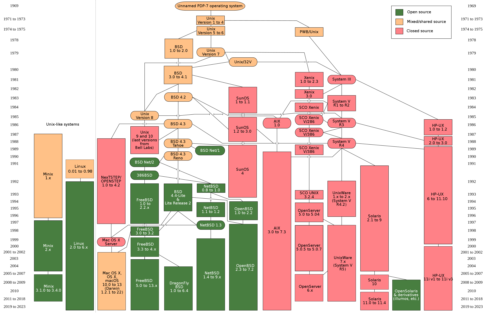

# 리눅스 1차 03/02

# UTL UNIX To Linux

iOS, Android, free BSD

- 유닉스 체계도



- 위에 OS들은 유닉스에서 파생됨

# 리눅스 종류

많은 것들 중 **Ubuntu Linux** 쓸 거임

# 터미널

---

**man 2 open** : 기초적인 메뉴얼, 명령어 설명 나옴

- **ping 8.8.8.8** : 네트워크 가능한지 볼 수 있음 [종료 - **control + c**]
- **vi** : 에디터임, 앞으로 파일 만들 때 **vi {파일 명}** 하면 됨
- **vim** : vi 확장된 거임
- **gcc** : 컴파일 해주는 거임 [**gcc {파일 명}**]

# vi

---

## 3개의 모드

- **입력** : i, a
- **명령** : esc / dd - 코드 다 삭제 / : + w - 저장 / : + q - 나가기 / :wq! - 강제 종료
- **라인** :

# 다운로드

sudo apt-get install - y {깔 거}

# gcc -o {바꿀 이름} {파일 이름}

- 옵션으로 실행하는 이름 바꿔줌

ls 보면 컴파일된 파일은 앞에 a.out가 있음, 그리고 이름을 바꿀 수 있음

- 실행하는 방법 : **./{바꿔준 이름} or ./a.out**

# 파일 이름 바꾸기 & 삭제

- **mv {기존 이름} {바꿀 이름}**
- **rmdir {파일 이름}** : 단 파일 내에 내용이 없으면 삭제됨

# cat {파일 명}

파일을 열지 않아도 코드를 보여줌

# grep

해당 코드를 뽑아옴

**cat {파일 명} | grep {뽑아올 코드}**

# cp {복사할 파일} {새로 만들 파일 명}

해당 파일을 새로운 파일을 만듦으로써 복사할 수 있음

# 에러 처리 코드

```c
 // ppt 봐~~
```

# 종료

halt -p
